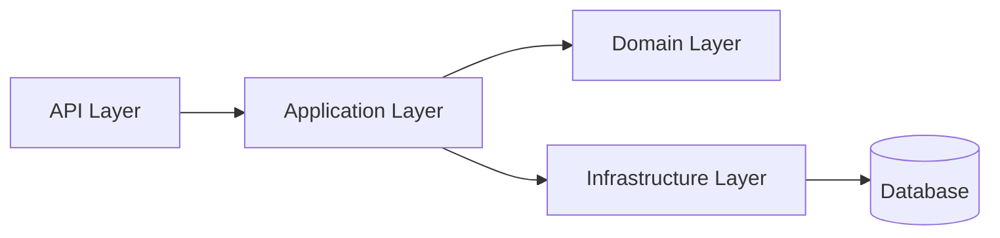
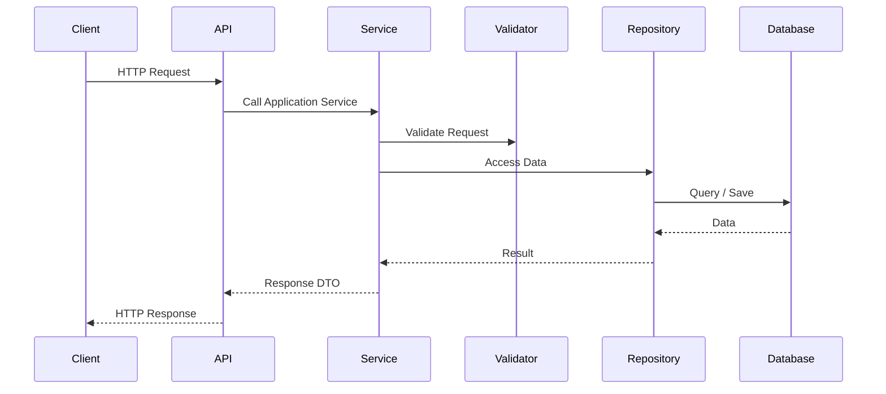
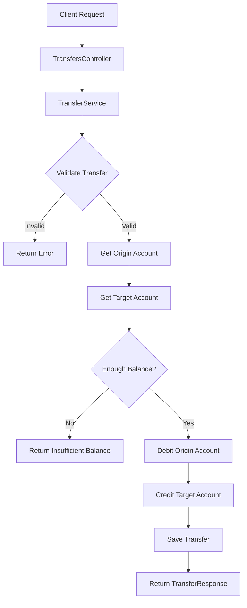

# Small Banking System API


A RESTful banking API built with **ASP.NET Core** designed using **layered architecture inspired by Clean Architecture**.

The system simulates core banking operations such as:

* Customer creation
* Account management
* Money transfers between accounts

This project was developed as a **backend architecture study project** focusing on separation of concerns and maintainable design.

---

# Architecture Overview



The architecture separates responsibilities across different layers to maintain a clean and scalable structure.

---

# Solution Structure

```text
SmallBankingSystem
│
├── SmallBankingSystem.API
│   ├── Controllers
│   │   ├── Customers
│   │   └── Transfers
│   │
│   ├── Middleware
│   ├── appsettings.json
│   └── Program.cs
│
├── SmallBankingSystem.Application
│   ├── Contracts
│   │   ├── Requests
│   │   │   ├── Account
│   │   │   ├── Customer
│   │   │   └── Transfer
│   │   │
│   │   └── Responses
│   │       ├── Account
│   │       ├── Customer
│   │       └── Transfer
│   │
│   ├── DependencyInjection
│   │
│   ├── Interfaces
│   │   ├── Repositories
│   │   └── Services
│   │
│   ├── Mappings
│   │   ├── AccountMappings
│   │   ├── CustomerMappings
│   │   └── TransferMappings
│   │
│   ├── Services
│   │
│   └── Validators
│       ├── CustomerValidators
│       └── TransferValidators
│
├── SmallBankingSystem.Domain
│   └── Models
│       ├── Entities
│       └── VOs
│
├── SmallBankingSystem.Infrastructure
│   ├── DependencyInjection
│   ├── Persistence
│   │   ├── Configuration
│   │   ├── DbContexts
│   │   └── Migrations
│   │
│   └── Repositories
│
└── SmallBankingSystem.Tests
```

---

# Layer Responsibilities

## API Layer

Responsible for handling HTTP requests and responses.

Contains:

* Controllers
* Middleware
* Application startup configuration

---

## Application Layer

Contains the application's business logic.

Responsibilities:

* Application Services
* DTOs (Requests and Responses)
* Validators
* Mappings
* Interfaces for services and repositories

---

## Domain Layer

Represents the **core business model**.

Contains:

* Entities
* Value Objects

This layer has **no dependencies on external frameworks**.

---

## Infrastructure Layer

Handles external concerns such as persistence and database access.

Contains:

* Entity Framework DbContext
* Database configuration
* Repository implementations
* Database migrations

---

## Tests

Contains automated tests for validating application behavior.

---

# Request Flow



---

# Transfer Flow



---

# API Endpoints

## Customers

Create customer

```
POST /api/customers
```

Example request:

```json
{
  "name": "John Doe",
  "email": "john@email.com"
}
```

---

Get customer by id

```
GET /api/customers/{id}
```

---

## Transfers

Create transfer

```
POST /api/transfers
```

Example request:

```json
{
  "originAccountId": "GUID",
  "targetAccountId": "GUID",
  "amount": 100
}
```

---

Get transfer by id

```
GET /api/transfers/{id}
```

---

# Error Handling

The API implements **global exception handling** using a custom middleware.

Errors follow the **ProblemDetails standard (RFC 7807)**.

Example error response:

```json
{
  "type": "https://httpstatuses.com/400",
  "title": "Invalid value",
  "status": 400,
  "detail": "Amount must be greater than zero",
  "instance": "/api/transfers"
}
```

---

# Technologies

* ASP.NET Core
* C#
* Entity Framework Core
* Swagger (OpenAPI)
* REST API

---

# Running the Project

Clone the repository:

```
git clone https://github.com/your-username/smallbankingsystem
```

Navigate to the project:

```
cd SmallBankingSystem
```

Run the application:

```
dotnet run
```

Swagger documentation will be available at:

```
https://localhost:{port}/swagger
```

---

# Future Improvements

* Add unit tests
* Add integration tests
* Implement authentication
* Improve validation layer
* Add transaction support

---

# Author
Luis Amaral
https://www.linkedin.com/in/luisamarall/

Backend architecture study project built with **ASP.NET Core**.
